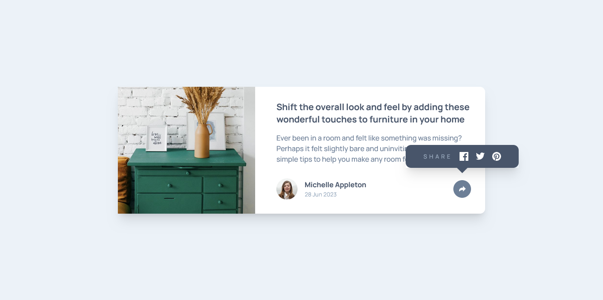

# Frontend Mentor - Article preview component solution

This is a solution to the [Article preview component challenge on Frontend Mentor](https://www.frontendmentor.io/challenges/article-preview-component-dYBN_pYFT). Frontend Mentor challenges help you improve your coding skills by building realistic projects.

## Table of contents

- [Overview](#overview)
  - [The challenge](#the-challenge)
  - [Screenshot](#screenshot)
  - [Links](#links)
- [My process](#my-process)
  - [Built with](#built-with)
  - [What I learned](#what-i-learned)
- [Author](#author)

## Overview

### The challenge

Users should be able to:

- View the optimal layout for the component depending on their device's screen size
- See the social media share links when they click the share icon

### Screenshot

### Links

- Solution URL: [Github](https://github.com/Adel-Harrat/FM-Article-preview-component)
- Live Site URL: [Vercel](https://fm-article-preview-component-seven.vercel.app/)

## My process

### Built with

- ReactJS
- TailwindCss
- Fully responsive

### What I learned

- How to make triangles in CSS (and in TailwindCSS)
- How to make images reponsive
- How to make a tooltip all by myself for the first time in my life xD

## Author

- Developer - Adel Harrat
- My Frontend Mentor Profile - [@Adel-Harrat](https://www.frontendmentor.io/profile/Adel-Harrat)
